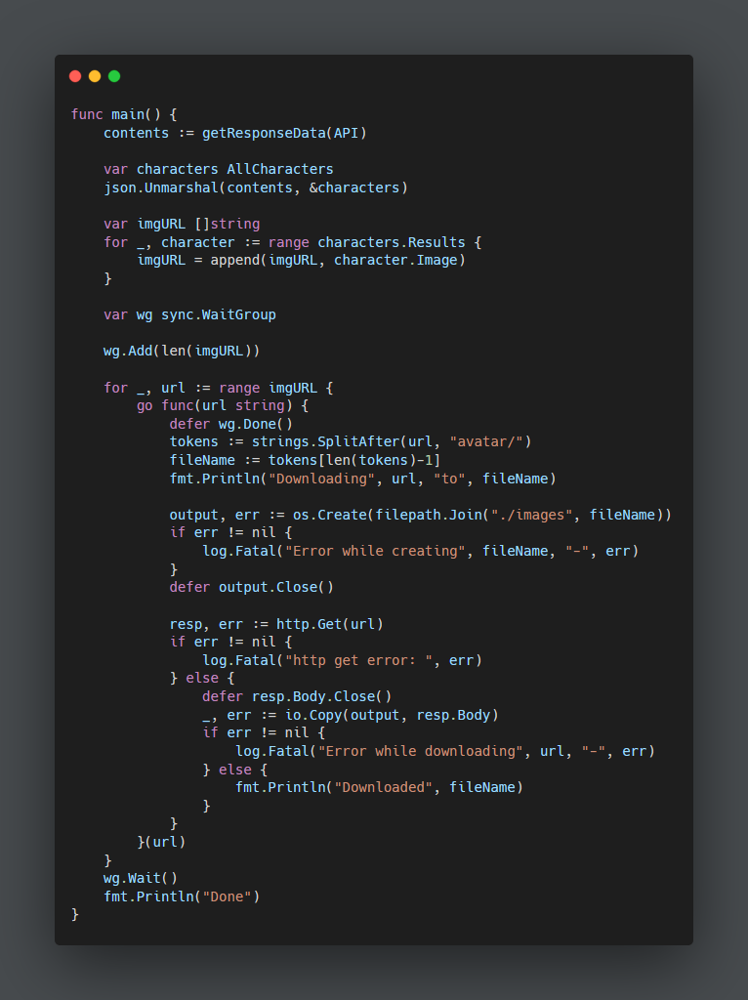

# GoRM

[Rick and Morty API](https://rickandmortyapi.com/)

This Go program is mainly for me to learn how to concurrently download multiple images from different URLs by connecting to a public API and parsing the nested JSON.

The [images folder](images) contains all the images downloaded from the API.

The screenshot below is `main.go`'s `main()` function's code:

[Goroutine Reference](https://gist.github.com/nevermosby/b54d473ea9153bb75eebd14d8d816544)

[JSON Struct Reference](https://github.com/pitakill/rickandmortyapigowrapper/blob/master/character_structs.go)
